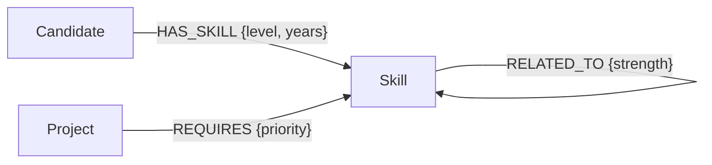

# GraphLens — Explainable Skill & Project Explorer

A graph application exploring how candidates, skills, and projects connect, backed by CognoDB and the official Neo4j Python driver.

## Why a graph database?
Recommendations combine direct skills, adjacent skills, project requirements, and relationship properties. These multi-hop paths are explicit in a graph and avoid awkward join tables and recursive SQL.

## Model


## Run
Create a free instance at https://console.cognodb.com/signup, then set:
```bash
export COGNODB_URI='bolt+s://<instance-id>.databases.cognodb.cloud'
export COGNODB_USER='cognodb'
export COGNODB_PASSWORD='<one-time-password>'
pip install -r requirements.txt
python seed.py
uvicorn app:app --reload
```
Open http://localhost:8000. Never commit secrets. The app includes loading/error/empty-friendly responses and parameterized Cypher.

## Queries
`queries.cypher` includes a direct skill query and a multi-hop Candidate -> Skill -> RELATED_TO -> Project traversal. The UI ranks projects by matched graph paths and explains each match.

## Submission checklist
Deploy to a free Python host, add the hosted URL and screenshots here, and record a 60–90 second walkthrough showing profile selection, recommendations, explanations, and an empty/error state.
